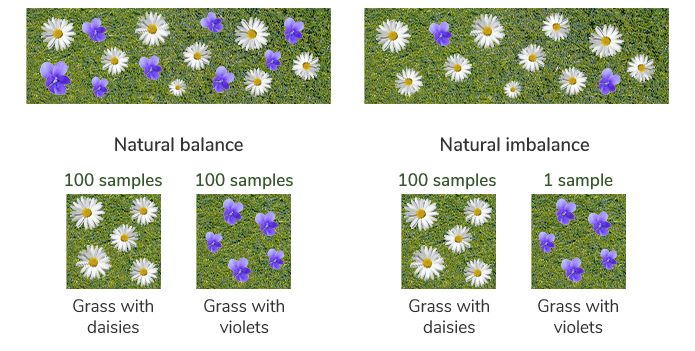
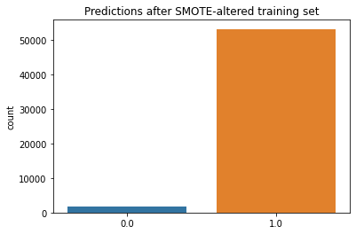
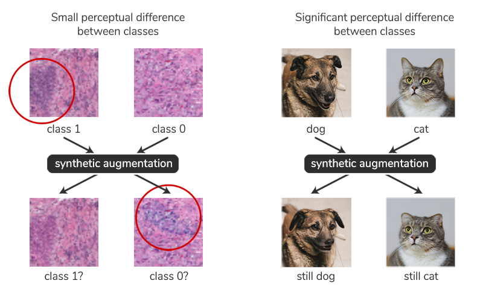
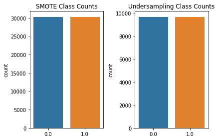

# Giải thích các file
-	EDA and Data Preprocessing: file này tôi dùng cho bước phân tích khám phá dữ liệu và tiền xử lý dữ liệu.
-	Train 5 models with truncated dataset: file này tôi dùng để huấn luyện 5 mô hình cơ sở với tập dữ liệu rút gọn (20% dữ liệu lớn).
-	Train EfficientNetB0 with all datasets: file này tôi dùng để huấn luyện mô hình EfficientNetB0 với toàn bộ tập dữ liệu gốc (dữ liệu lớn). EfficientNetB0 là kiến trúc mạng cho ra hiệu suất tốt nhất khi tôi đánh giá 5 mô hình cơ sở.
-	Test class weights with EfficientNetB0: file này tôi dùng để huấn luyện lại mô hình EfficientNetB0 với các class weights khác nhau.
# Ứng dụng Học sâu phân loại Ung thư vú
## I. Tóm tắt

Histopathological classification based on tissue samples and occurrences visual features in the images is an important stage in the breast cancer diagnostic process. This is a long and laborious process, and requires experience. This project, I worked within the field of Medical Imaging Diagnosis, tackling the classification of one of the major groups of cancer - breast cancer. Specifically, I applied Deep Learning technique in classifying benign and malignant invasive ductal carcinoma from histopathological images. I started out by performing Domain Research, and getting familiar with the domain I"m trying to solve a problem in. Then I proceeded with Exploratory Data Analysis, and began the standard Machine Learning Workflow. To solve the problem, I built CNN from scratch, as well as using predefined architectures, as well as use pre-defined architectures (such as the EfficientNetB0, VGG16, ResNet50, Xception). I identified the most promising base model as the EfficientNetB0, I performed hyperparameter tuning, and evaluated the model. The results show that the EfficientNetB0 model can correctly classify up to 88.03% with F1 score of 81.19%. Fast, accurate and early diagnosis improves the probability of survival. Accordingly, Machine Learning models can be deployed locally, and can process large sums of data in a fraction of the time it takes humans. As a result, doctors can focus on what they"re the best at - administering medicine, observing the effects and steering the procedure to help patients.

Phân loại mô bệnh học dựa trên các mẫu mô và sự xuất hiện các đặc điểm trực quan trong ảnh mô bệnh học là một giai đoạn quan trọng trong quy trình chẩn đoán Ung thư vú. Đây là quá trình lâu dài và tốn nhiều công sức, đồng thời đòi hỏi kinh nghiệm. Đồ án này tôi đã làm việc trong lĩnh vực chẩn đoán hình ảnh y tế, giải quyết việc phân loại một trong những nhóm chính của bệnh ung thư - Ung thư vú. Cụ thể, tôi đã áp dụng kỹ thuật Học sâu trong việc phân loại Ung thư biểu mô ống dẫn sữa xâm lấn lành tính và ác tính từ hình ảnh mô bệnh học. Tôi đã bắt đầu bằng cách thực hiện nghiên cứu và làm quen với lĩnh vực mà tôi đang cố gắng giải quyết vấn đề. Sau đó, tôi tiến hành Phân tích dữ liệu khám phá và bắt đầu đi vào quy trình làm việc của Học máy. Để giải quyết bài toán, tôi đã xây dựng CNN từ đầu, cũng như sử dụng các kiến trúc được xác định trước (chẳng hạn như EfficientNetB0, VGG16, ResNet50, Xception). Tôi xác định được mô hình cơ sở hứa hẹn nhất là EfficientNetB0, tôi đã thực hiện điều chỉnh siêu tham số và đánh giá mô hình. Kết quả cho thấy mô hình EfficientNetB0 có thể phân loại chính xác lên đến 88.03% với điểm F1 là 81.19%. Chẩn đoán nhanh, chính xác và sớm cải thiện xác suất sống sót. Theo đó, các mô hình Học máy có thể được triển khai ở địa phương và có thể xử lý lượng lớn dữ liệu trong một phần nhỏ thời gian mà con người cần. Kết quả là bác sĩ có thể tập trung vào những gì họ giỏi nhất - quản lý thuốc, quan sát các triệu chứng và đưa ra quy trình để giúp bệnh nhân.

## II. Tổng quan
Trong dự án này, tôi muốn viết về ứng dụng phân loại của Deep learning (DL) ở cấp độ nghiên cứu!

Với tư cách là một kỹ sư máy tính trẻ - tôi đang khám phá triển vọng của sự ứng dụng các thuật toán Machine learning (ML) cho các lĩnh vực khác nhau và trích xuất đặc trưng từ dữ liệu. Chẩn đoán ung thư sớm, chính xác và nhanh chóng giúp cải thiện xác suất sống sót, và chẩn đoán ung thư vú sớm có thể cứu sống tới 400.000 người mỗi năm. Các mô hình Học máy có thể được triển khai trên toàn cầu hoặc mỗi địa phương và có thể xử lý lượng lớn dữ liệu trong một phần nhỏ thời gian mà con người cần.

Ung thư biểu mô tuyến xâm lấn (IDC) là loại phụ phổ biến nhất của tất cả các loại ung thư vú. Ung thư vú là dạng ung thư phổ biến nhất ở phụ nữ. Xác định và phân loại chính xác các loại ung thư vú là một nhiệm vụ lâm sàng quan trọng và các phương pháp tự động có thể được sử dụng để tiết kiệm thời gian và giảm thiểu sai sót.

Là một người thực hành ML, bạn có thể giúp tạo ra sự khác biệt.

Trong dự án này, tôi sẽ làm việc trong lĩnh vực Chẩn đoán Hình ảnh Y tế, giải quyết việc phân loại một trong những nhóm chính của bệnh ung thư - Ung thư vú.

Dự án Phân loại ung thư vú với Keras và TensorFlow, tôi sẽ đi sâu vào một dự án thực hành, từ đầu đến cuối, xem xét thử thách là gì, phần thưởng sẽ là gì khi giải quyết nó. Cụ thể, tôi sẽ phân loại ung thư biểu mô tuyến xâm lấn lành tính và ác tính từ hình ảnh mô bệnh học. Nếu bạn không quen với thuật ngữ này - không cần lo lắng, nó đã được tôi đề cập trong dự án.

Tôi sẽ bắt đầu bằng cách thực hiện tìm hiểu và làm quen với Ung thư vú, đối tượng mà tôi đang cố gắng giải quyết vấn đề. Sau đó, tôi sẽ tiến hành Phân tích dữ liệu khám phá và bắt đầu Quy trình làm việc tiêu chuẩn của học máy. Đối với hướng dẫn này, chúng ta sẽ xây dựng CNN từ đầu , cũng như sử dụng các kiến trúc được xác định trước (chẳng hạn như họ EfficientNet hoặc họ ResNet). Khi tôi đánh giá được mô hình cơ sở hứa hẹn nhất, tôi sẽ thực hiện điều chỉnh siêu tham số và đánh giá mô hình.

## III. Học máy trong y học
Học máy ngày càng được ứng dụng nhiều hơn trong y học và đang giúp cứu sống nhiều người khỏi nhiều tình trạng bệnh lý khác nhau. Ứng dụng của Học máy trong Y học là rất lớn và là một chủ đề cực kỳ phức tạp, nhưng một số lĩnh vực chính bao gồm:

- Y học chính xác (Điều chỉnh thuốc cho bệnh nhân)
- Chẩn đoán hình ảnh y tế (Chẩn đoán điều kiện dựa trên hình ảnh, v.v.)
- Khám phá thuốc (Tạo ra các cấu trúc như protein hoặc các phân tử giống thuốc, dự đoán hoạt tính sinh học, v.v.)

## 1. Tuyên bố thách thức/vấn đề
Hãy dành một chút thời gian để xác định vấn đề mà tôi đang cố gắng giải quyết:

Ung thư thường dễ nhận thấy trong mô và có thể dễ dàng điều trị hơn khi được phát hiện sớm. Mô học nghiên cứu các mô và Bệnh học nghiên cứu bệnh tật. Mô bệnh học nghiên cứu các bệnh trong mô! Các nhà giải phẫu bệnh kiểm tra hình ảnh của mô (hình ảnh mô học) và đưa ra kết luận. Ung thư giết chết 10 triệu người mỗi năm và là một trong những nguyên nhân gây tử vong hàng đầu trên toàn cầu. Cùng với ung thư phổi, ruột kết và dạ dày - ung thư vú giết chết 700.000 người mỗi năm. Một số khu vực có thể không có thiết bị hoặc phòng ý tế cần thiết để chẩn đoán trở thành một quy trình nhanh chóng, vì vậy bệnh nhân có thể phải đi lại khó khăn để được chẩn đoán, kéo dài thời gian họ không thể điều trị.

Theo một nghĩa nào đó, các nhà nghiên cứu bệnh học đang thực hiện phân loại (lành tính hoặc ác tính) dựa trên các mẫu và sự xuất hiện trong hình ảnh (các đặc điểm trực quan). Đây là một quá trình lâu dài và tốn nhiều công sức, đồng thời đòi hỏi kinh nghiệm.


## 2. Lợi ích cho việc giải quyết vấn đề
Chẩn đoán nhanh, chính xác và sớm cải thiện xác suất sống sót. Các mô hình Học máy có thể được triển khai trên toàn cầu hoặc cục bộ và có thể xử lý lượng lớn dữ liệu trong một phần nhỏ thời gian mà con người cần. Trên nhiều trường hợp khác nhau - người ta đã chứng minh rằng các mô hình Học máy, khi được huấn luyện đúng cách, có thể phân biệt các đặc trưng tốt hơn con người và có thể thực hiện phân loại hình ảnh ở mức độ chính xác cao hơn, ngay cả khi không có nhiều ngữ cảnh hoặc độ phân giải hình ảnh thấp.

Theo Cleveland Clinic :

Ung thư biểu mô ống xâm lấn có khả năng chữa khỏi khá cao, đặc biệt là khi được phát hiện và điều trị sớm. Tỷ lệ sống sót sau năm năm đối với ung thư biểu mô ống xâm lấn là cao - gần 100% khi được điều trị sớm. Nếu ung thư đã lan sang các mô khác trong khu vực, tỷ lệ sống sót sau năm năm là 86%. Nếu ung thư đã di căn đến các vùng xa của cơ thể, tỷ lệ sống sót sau 5 năm là 28%.

Một tính toán nhanh cho thấy việc phát hiện sớm có thể cứu sống 400.000 người mỗi năm. Có một động lực lớn để cung cấp các công cụ chẩn đoán toàn cầu, có thể truy cập, chính xác và nhanh chóng, đặc biệt là ở các khu vực khó có được chuyên môn. Với các nhiệm vụ dễ tự động hóa, bác sĩ có thể tập trung vào những gì họ giỏi nhất - quản lý thuốc, quan sát các triệu chứng và chỉ dẫn quy trình điều trị để giúp bệnh nhân.


## 3. Tìm hiểu và giới thiệu bệnh
Hãy dành một chút thời gian để làm quen với đối tượng mà tôi đang làm việc. Khi cố gắng giải quyết một vấn đề trong bất kỳ lĩnh vực nào, ít nhất bạn phải có kiến thức thô sơ về những gì bạn đang cố gắng giải quyết, tại sao bạn đang cố gắng giải quyết nó và dữ liệu có ý nghĩa gì trong ngữ cảnh của lĩnh vực. Nếu không biết bất kỳ điều gì về đối tượng - thật khó để biết liệu một mô hình có thực sự hoạt động hay không. Theo nguyên tắc chung - tốt nhất bạn nên tham khảo ý kiến của một người nào đó trong lĩnh vực này (1 bác sỹ chuyên khoa) và lấy ý kiến đóng góp của họ, đặc biệt là trong giai đoạn phát triển mô hình sau này.

Mặc dù vậy - để bắt đầu, bạn thường phải tự làm, vì vậy việc có thể nhanh chóng nắm được một số khái niệm cơ bản là rất quan trọng!

Ung thư biểu mô ống dẫn trứng xâm lấn (IDC) cho đến nay là loại phụ ung thư vú phổ biến nhất, chiếm 80% các trường hợp. Chỉ bằng cách giải quyết một loại phụ này, chúng tôi có thể giải quyết 80% các trường hợp.

Các khối u là những bó tế bào không được bó lại và phát triển thành những cục rắn. Các khối u có thể là lành tính (không phải ung thư) và tập trung vào một vùng cụ thể và có thể không gây ra bất kỳ vấn đề nào. Tuy nhiên, chúng có thể phát triển và gây ra các vấn đề thông qua kích thước tuyệt đối. Nếu một khối u bắt đầu phát triển bên ngoài vùng hỗn hợp của nhóm tế bào - nó sẽ trở thành ác tính (ung thư). Ung thư có thể xâm lấn mô cục bộ hoặc di căn và tấn công mô xa hơn. Còn nhiều điều cần nói về khối u và ung thư, bao gồm các dạng phụ và mức độ của nó, nhưng bộ dữ liệu mà chúng tôi đang làm việc chỉ đơn giản là phân loại hình ảnh là không ung thư (lành tính) và ung thư (ác tính).

Đối với tập dữ liệu cụ thể này, bạn cần phải có rất ít kiến thức y tế đáng ngạc nhiên để xây dựng một bộ phân loại có khả năng. Điều này một phần lớn là do các bác sĩ y học đã phải mất hàng trăm năm tích lũy kiến thức khoa học để ghi nhãn và chuẩn bị bộ dữ liệu mà từ đó chúng ta có thể suy ra kiến thức. Dựa trên kinh nghiệm và chuyên môn của họ, chúng tôi có thể xây dựng các mô hình để khai thác và phân loại đối tượng địa lý, với mức độ chính xác và tính toàn vẹn cao.

Đối với một kỹ sư Học máy - nhiệm vụ này gần như chỉ tập trung vào việc phân loại hình ảnh thông thường! Tuy nhiên, có một số tác động nhất định đi kèm với tập dữ liệu này, hiếm khi xuất hiện trong các tập dữ liệu khác mà bạn có thể đã làm việc trước đây. Tôi sẽ đặc biệt tập trung vào việc đưa ra các phỏng đoán có học thức trong phần sau, đồng thời xem xét sự mất cân bằng trong lớp học, sự gia tăng, học tập nhạy cảm với chi phí, v.v.

## IV. Phân tích dữ liệu khám phá (EDA) 
## 1. Loading the Data

Chúng tôi sẽ bắt đầu bằng cách tải xuống bộ dữ liệu và tải nó vào. Chúng tôi sẽ làm việc với bộ dữ liệu Hình ảnh [Mô bệnh học Vú](https://www.kaggle.com/datasets/paultimothymooney/breast-histopathology-images). Nó chứa 198738 bản vá hình ảnh IDC (-) và 78786 bản vá hình ảnh IDC (+) .

- IDC (-) đề cập đến các trường hợp lành tính
- IDC (+) dùng để chỉ các trường hợp ác tính

Lưu ý: IDC (-) trong tập dữ liệu này ngụ ý rằng bệnh nhân không bị ung thư biểu mô ống dẫn sữa xâm lấn . Nó ngụ ý rằng họ có một trường hợp lành tính hoặc mô bình thường, chứ không phải là một trường hợp ác tính . Bên cạnh IDC, một tình trạng khác cũng tồn tại - Ung thư biểu mô ống không xâm lấn còn được gọi là ung thư biểu mô tại chỗ (DCIS) .

Bộ dữ liệu lấy từ một nghiên cứu năm 2016 - ["Học sâu để phân tích hình ảnh bệnh lý kỹ thuật số: Hướng dẫn toàn diện với các trường hợp sử dụng được chọn"](https://pubmed.ncbi.nlm.nih.gov/27563488/) của Andrew Janowczyk và Anant Madabhushi. Nghiên cứu của họ tập trung vào một số nhiệm vụ, một trong số đó là xác định IDC, mà họ có điểm F1 là 0,7648 trên 50k bản vá thử nghiệm.

Tập dữ liệu mà chúng tôi đang làm việc được lấy từ 279 bệnh nhân, mỗi bệnh nhân có một ID duy nhất. Mỗi bệnh nhân có một thư mục chuyên dụng, được đặt tên theo ID của họ, với hai thư mục con 0 và 1. Thư mục được đặt tên 0 bao gồm hình ảnh của các mẫu mô lành tính (những mẫu không có dấu IDC). Thư mục được đặt tên 1 bao gồm hình ảnh của các mẫu mô ác tính (những mẫu có chứa dấu IDC).

Hình ảnh mô bệnh học có kích thước lớn, còn các đặc điểm và điểm đánh dấu rất nhỏ, đó là lý do tại sao hình ảnh được chia nhỏ thành các mảng , kích thước 50x50 pixel. Do đó, mỗi bệnh nhân có nhiều bản vá hình ảnh, gộp lại sẽ bao gồm toàn bộ hình ảnh.

Mỗi bản vá có một định dạng tên riêng - uxXyYclassC.png, trong đó u là ID của bệnh nhân, x là tọa độ X mà từ đó bản vá được trích xuất, ylà tọa độ Y mà từ đó bản vá được trích xuất và class là 0 hoặc 1, biểu thị liệu có các dấu IDC hay không hoặc không có trong bản vá đó.

Các tọa độ được đưa ra để toàn bộ hình ảnh có thể được tái tạo từ các mảng, nhưng cũng để chúng ta có thể tô màu các mảng trong toàn bộ ảnh, đây là quy trình khá chuẩn trong bệnh học. Tôi sẽ sớm thực hiện việc này trong phần EDA!

Đó là tất cả những gì đang được nói - tôi đã tải xuống tệp zip và giải nén nó thành `breast-histopathology-images`:

```
data = os.listdir("./breast-histopathology-images/")
len(data)
# 279
```

Thật vậy, có 279 thư mục, biểu thị 279 ID bệnh nhân:
```
data[:10]
```

Chúng ta hãy xem xét 10 bệnh nhân đầu tiên:
```
['10253',
 '10254',
 '10255',
 '10256',
 '10257',
 '10258',
 '10259',
 '10260',
 '10261',
 '10262']
 ```
 
 Trong mỗi thư mục này, có một thư mục 0 và 1:
 ```
 patient_10253 = os.listdir("./breast-histopathology-images/10253")
# ['0', '1']
```

Và trong mỗi chúng, một số hình ảnh:
```
patient_10253_0 = os.listdir("./breast-histopathology-images/10253/0")
patient_10253_1 = os.listdir("./breast-histopathology-images/10253/1")

print(patient_10253_0[:5])
# ['10253_idx5_x1001_y1001_class0.png', '10253_idx5_x1001_y1051_class0.png', '10253_idx5_x1001_y1101_class0.png', '10253_idx5_x1001_y1151_class0.png', '10253_idx5_x1001_y1201_class0.png']
print(patient_10253_1[:5])
# ['10253_idx5_x501_y351_class1.png', '10253_idx5_x501_y401_class1.png', '10253_idx5_x551_y301_class1.png', '10253_idx5_x551_y351_class1.png', '10253_idx5_x551_y401_class1.png']
```

Các tên tệp ở cuối dài hơn, nhưng chứa dữ liệu thực sự có giá trị! Làm việc với danh sách không thực sự lý tưởng, vì vậy chúng ta hãy chỉ lấy dữ liệu cho bệnh nhân đầu tiên và lưu trữ nó trong một vài `DataFrames` thay vào đó, kết hợp chúng với nhau thành một dữ liệu duy nhất:
```
df_0 = pd.DataFrame()

for path in patient_10253_0:
    split = path.split('_')
    # Extract elements 2 and 3, substringing the first char
    x_coord = split[2][1:]
    y_coord = split[3][1:]
    idc_class = 0
    
    data = {"path":"./breast-histopathology-images/10253/0/"+path,
            "x_coord": x_coord,
            "y_coord": y_coord,
            "idc_class": idc_class}
    
    df_0 = df_0.append(data, ignore_index=True)
    
    
print(df_0)

df_1 = pd.DataFrame()

for path in patient_10253_1:
    split = path.split('_')
    # Extract elements 2 and 3, substringing the first char
    x_coord = split[2][1:]
    y_coord = split[3][1:]
    idc_class = 1
    # Hardcoded path for now, we'll address this later
    data = {"path":"./breast-histopathology-images/10253/1/"+path,
            "x_coord": x_coord,
            "y_coord": y_coord,
            "idc_class": idc_class}
    
    df_1 = df_1.append(data, ignore_index=True)
    
    
# Combine dataframes
df = df_0.append(df_1).reset_index()
# Convert the coordinates to integers, from objects
df['x_coord'] = df['x_coord'].astype('int')
df['y_coord'] = df['y_coord'].astype('int')
```

Khung dữ liệu này hiện bao gồm:


Tuyệt vời, tôi có các đường dẫn vá (có nghĩa là, tôi có thể lấy hình ảnh cho từng cái), x_coordvà y_coordcho từng bản vá (nghĩa là, chúng tôi biết vị trí của nó trong hình ảnh) và idc_class cho bản vá cụ thể đó! Sử dụng dữ liệu này, chúng tôi có thể tái tạo lại toàn bộ hình ảnh ban đầu và thậm chí còn đánh dấu các phần tích cực IDC trong chúng, với một màu khác như thể bằng bút đánh dấu.

## 2. Phân tích dữ liệu khám phá (EDA)
Trước khi tạo lại hình ảnh, hãy thử tạo một biểu đồ phân tán với dữ liệu này, đặt `c` (màu) tương ứng với bắt đầu của các bản vá (góc trên bên trái):`idc_class`
```
fig, ax = plt.subplots(figsize=(8, 8))
ax.scatter(x = df['x_coord'], y=df['y_coord'], c=df['idc_class'], cmap='coolwarm')
plt.show()
```

Điều này dẫn đến một hình ảnh khá rõ ràng:


Có vẻ như một số bản vá bị thiếu! Trang Kaggle không đề cập đến vấn đề này, nhưng nhìn chung, các điểm dữ liệu thường bị thiếu do bị cắt bớt trong quá trình xử lý dữ liệu thô hoặc do một công cụ bị lỗi, khiến điểm dữ liệu mất giá trị thông tin.

Mặc dù vậy, chúng ta vẫn sẽ ổn nếu không có một số bản vá lỗi này. Hãy tiếp tục và thử tái tạo lại hình ảnh này, vẽ một bản vá thích hợp , thay vì một điểm đánh dấu biểu đồ phân tán. Vì chúng tôi đang xử lý một danh sách các bản vá phong phú và việc phải đối phó với nhiều Axestrường hợp có thể khá mệt mỏi - hãy tạo một lưới các "bản vá" (stand-in) và mặt nạ cho các bản vá tích cực IDC, có thể được tô màu bằng một màu khác và được "đóng dấu trên" hình ảnh bên dưới. Phương pháp này được lấy cảm hứng từ Kaggle Grandmaster Laura Fink!

Lưới và mặt nạ đều sẽ bắt đầu với các giá trị đứng, lý tưởng nhất là màu trắng. Màu trắng được biểu thị dưới dạng tất cả các kênh RGB, với các giá trị là 255, vì vậy chúng tôi có thể tạo lưới và mặt nạ màu trắng với:
```
grid = 255*np.ones(shape = (100, 100, 3)).astype(np.uint8)
mask = 255*np.ones(shape = (100, 100, 3)).astype(np.uint8)
```

Bây giờ cả hai về cơ bản sẽ là:
```
array([[[255, 255, 255],
        [255, 255, 255],
        [255, 255, 255],
        ...,
        [255, 255, 255],
        [255, 255, 255],
        [255, 255, 255]],
        ...
```
Và hình dạng:
```
print(grid.shape) # (100, 100, 3)
```
        
Nếu chúng ta hình dung chúng dưới dạng hình ảnh - sẽ không có nhiều điều xảy ra - chúng đều là các pixel màu trắng. Hãy sử dụng các giá trị tối đa của chúng tôi x_coordvà của chúng tôi y_coordlàm trình bao bọc để biết có bao nhiêu pixel trong hình ảnh (hình dạng của lưới và mặt nạ) và đối với mỗi hình ảnh trong DataFrame, lấy x_coordvà y_coord, đặt ranh giới của nó (__coord+50) và in dấu pixel giá trị của hình ảnh trên lưới:
```
max_x = df['x_coord'].max()
max_y = df['y_coord'].max()

# Shape of (2101, 2651, 3)
# A placeholder for each pixel, with 3 color options and max values for each channel (RGB)
grid = 255*np.ones(shape = (max_y + 50, max_x + 50, 3)).astype(np.uint8)
mask = 255*np.ones(shape = (max_y + 50, max_x + 50, 3)).astype(np.uint8)

for i in range(len(df)):
        # Get image and label
        image = cv2.imread(df['path'][i])
        idc_class = df['idc_class'][i]
            
        # Extract X and Y coordinates
        x_coord = df['x_coord'][i]
        y_coord = df['y_coord'][i]
        # Add 50 pixels to find ending boundary for each image
        x_end = x_coord + 50
        y_end = y_coord + 50
        
        # Assign image pixel values to placeholder 255 values
        """
        Image is something along the lines of:
        [[[206 164 226]
          [196 154 224]
          [211 175 225]
          ...
          [237 221 240]
          [214 184 232]
          [235 213 243]],
          ...        
        """
        # `grid` will then contain each patch's image values encoded into the grid
        grid[y_coord:y_end, x_coord:x_end] = image
        
        # If `idc_class` is `1`, change the RED channel of the `mask` to 255 (intense red)
        # and other channels to `0` (remove color info, leaving just red)
        if idc_class == 1:
            mask[y_coord:y_end, x_coord:x_end, :1] = 255
            mask[y_coord:y_end, x_coord:x_end, 1:] = 0
```

Cuối cùng, chúng ta có thể hiển thị lưới và mặt nạ ở trên nó:
```
plt.figure(figsize=(12, 12))
plt.imshow(grid)
plt.imshow(mask, alpha=0.1)
plt.show()
```


Hãy tải thêm dữ liệu, tạo ra một DataFramebao gồm thông tin của tất cả các bản vá, ID bệnh nhân, lớp IDC của họ, v.v. và thống kê tóm tắt biểu đồ sẽ giúp chúng ta có cái nhìn chung về tập dữ liệu:
```
from glob import glob
data = glob('./breast-histopathology-images/**/*.png', recursive=True)
print(len(data))
# 277524

dfs = []

for path in data:
    split = path.split('_')
    # Extract elements 2 and 3, substringing the first char
    patient_id = split[0].split('\\')[1]
    x_coord = split[2][1:]
    y_coord = split[3][1:]
    idc_class = split[4][-5]
    
    df_data = {"patient_id": patient_id,
            "x_coord": x_coord,
            "y_coord": y_coord,
            "idc_class": idc_class,
            "path": path}
    df = pd.DataFrame()
    dfs.append(df.append(df_data, ignore_index=True))
    
df_all = pd.concat(dfs)
# Reset index aftet concatenation
df_all = df_all.reset_index(drop=True)

df_all['x_coord'] = df_all['x_coord'].astype('int')
df_all['y_coord'] = df_all['y_coord'].astype('int')
df_all['idc_class'] = df_all['idc_class'].astype('int')
```

Lưu ý: Đoạn mã này mất một chút thời gian để thực thi, vì chúng tôi đang tạo một đoạn mã khá lớn DataFrame.

Hãy bắt đầu với một âm mưu đếm của idc_class:
```
import seaborn as sns
sns.countplot(x='idc_class', data=df_all)
```


Có một sự mất cân bằng khá lớn giữa các lớp. Điều này sẽ làm cho việc khái quát hóa khó khăn hơn, vì việc tập trung vào tầng lớp thống trị có thể tỏ ra thuận lợi với một số kiến ​​trúc nhất định. Chúng ta sẽ xem xét chi tiết về sự mất cân bằng lớp và ý nghĩa của nó trong bài học tiếp theo, trong quá trình xử lý trước dữ liệu.

Hãy xem tần suất hình ảnh trên mỗi bệnh nhân - chúng có trải đều không?
```
df_all['patient_id'].value_counts()
```

Một số bệnh nhân có nhiều dữ liệu hơn những bệnh nhân khác và số lượng dữ liệu trên mỗi bệnh nhân rất đa dạng!
```
13693    2395
16550    2302
10288    2278
10308    2278
9323     2216
         ... 
16895     151
9175      118
8957      111
9262       94
16534      63
```

Điều này sẽ không làm cho việc đào tạo và học hỏi từ các bản vá này trở nên khó khăn hơn - chúng tôi sẽ đào tạo một hệ thống chẩn đoán IDC bằng bản vá , không phải bằng toàn bộ hình ảnh. Mặc dù vậy, sẽ khó hơn một chút nếu chúng tôi muốn chạy thử nghiệm cho tất cả bệnh nhân và làm nổi bật các vùng trong mô được đánh giá là dương tính với IDC, vì không phải tất cả bệnh nhân đều có toàn bộ hình ảnh có thể được sử dụng cho chú thích.

Hãy vẽ toàn bộ hình ảnh cho một số bệnh nhân từ đầu danh sách:
```
patient_ids = ['13693', '16550', '10288', '10308', '9323']

for patient_id in patient_ids:
    df = df_all.loc[df_all['patient_id'] == patient_id].reset_index(drop=True)
    max_x = df['x_coord'].max()
    max_y = df['y_coord'].max()
    
    grid = 255*np.ones(shape = (max_y + 50, max_x + 50, 3)).astype(np.uint8)
    mask = 255*np.ones(shape = (max_y + 50, max_x + 50, 3)).astype(np.uint8)

    for i in range(len(df)):
        # Get image and label
        image = cv2.imread(df['path'][i])
        # Image shape might not be 50x50, in which case, it's a broken patch
        # and I don't want to load it in
        if(image.shape==(50, 50, 3)):
            idc_class = df['idc_class'][i]
            x_coord = df['x_coord'][i]
            y_coord = df['y_coord'][i]
            x_end = x_coord + 50
            y_end = y_coord + 50
            
            grid[y_coord:y_end, x_coord:x_end] = image

            if idc_class == 1:
                mask[y_coord:y_end, x_coord:x_end, :1] = 255
                mask[y_coord:y_end, x_coord:x_end, 1:] = 0
                
    plt.figure(figsize=(8, 8))
    plt.suptitle(f'Patient ID: {patient_id}')
    plt.imshow(grid)
    plt.imshow(mask, alpha=0.2)
    plt.show()
```


Một số trang chiếu có diện tích nhỏ được che bởi mặt nạ, chẳng hạn như với bệnh nhân 10288 , mặc dù một số có diện tích khá lớn, chẳng hạn như bệnh nhân 10308 . Hãy xem liệu chúng ta có thể đào tạo một bộ phân loại để tìm ra lý do tại sao một số bản vá lỗi IDC tích cực và bản vá lỗi nào không.

## V. Machine Learning Workflow
We've done Exploratory Data Analysis and got familiar with the dataset we're working with. Now - it's time to hop into the standard Machine Learning Workflow, starting with preprocessing data.
## 1. Data Preprocessing
We've worked with DataFrames so far, though, this was all without images - I only stored their paths in case I want to retrieve and plot them. One way to load images is to simply iterate through the data and load them in:
```
import cv2

x = []
y = []

# Loading in 1000 images
for i in data[:1000]:
    if i.endswith('.png'):
        label=i[-5]
        img = cv2.imread(i)
        # Transformation steps, such as resizing
        img = cv2.resize(img,(200,200))
        x.append(img)
        y.append(label)
```
x and y are Python lists - which are very efficient at appending data at the cost of higher memory usage. Let's convert them to NumPy arrays, split them into a training and testing set, and call the garbage collection module to clear x and y from memory since I won't be using them anymore:
```
# Reduce from float32 for memory footprint
x = np.array(x, dtype='float16')
y = np.array(y, dtype='float16')

from sklearn.model_selection import train_test_split
x_train,x_test,y_train,y_test=train_test_split(x,y, shuffle=True, test_size=0.3)

import gc
x = None
y = None
gc.collect()
```
```
x_train.shape
# (700, 200, 200, 3)
```
This is the general process for converting images to NumPy arrays, but there's an issue here. I have 277k images. For images of size 50x50 - this could probably fit into a home system with 256GB of RAM into memory, but even though it can, it's just plain inefficient. There's no need to strain a machine with all of the images being loaded into memory at once, and 50x50 images are fairly small, making it harder to extract meaningful feature maps from them.

On a more home-like machine, with 32-64GB of RAM, you could fit up to 25k images of 100x100 size, of 10k of 200x200 into memory, yet this is inefficient as well.

This is where ImageDataGenerator comes in! I can stream data directly from our disk, loading batches into the memory and seamlessly providing the next batch during training (optionally, applying transformations to achieve data augmentation) instead. This can scale down to machines with as little as a single gigabyte of memory, if need be!

****
The issue is - ImageDataGenerator assumes a folder structure, that I don't have.
****
Our data is formatted as:
```
patient_1
 - class0.png
 - class1.png
 - class1.png
 - class0.png
patient_2
 - class0.png
 - class1.png
 - class1.png
 - class0.png
...
```
While Keras expects:
```
class_1
 - sample0.png
 - sample1.png
 - sample2.png
class_0
 - sample0.png
 - sample1.png
 - sample2.png
```
If I were to use Keras' ImageDataGenerator class here - it could treat each patient as a class, and assume that we're trying to classify the patient based on the images within the directories.

I should instead be having a 1 and 0 directory, with images of IDC(+) and IDC(-) respectively. Additionally, it helps to have a /train and /test directory to create a test set generator from a totally separate dataset. Let's write a script that creates a truncated dataset, and reformats the directories to the format Keras would love to work with.

****
_Note: We're creating a truncated dataset to test out the models on smaller sets for efficiency's sake. You're free to use the entirety of the dataset, but be prepared to wait a long time before you can benchmark them. Once the benchmarking is done on smaller datasets, I can load in the entirety of the images._
****
```
if not os.path.exists('./hist_images_truncated/'):
    os.mkdir('./hist_images_truncated/')

    os.mkdir('./hist_images_truncated/train/')
    os.mkdir('./hist_images_truncated/test/')

    os.mkdir('./hist_images_truncated/train/0/')
    os.mkdir('./hist_images_truncated/train/1/')
    os.mkdir('./hist_images_truncated/test/0/')
    os.mkdir('./hist_images_truncated/test/1/')
```
Now, let's iterate over the length of the dataset, in large steps, and use the steps as the starting and ending indices for our data list, loading the associated images in, reshaping them, and saving them in the appropriate folder:
```
# enumerate() to get `batch_num`, starting at 1
# range() starting at 1000 and incrementing in steps of 1000 towards the fifth of the length of the dataset
for batch_num, indices in enumerate(range(1000, int(len(data)/5), 1000), 1):
    x = []
    y = []
    
    # Load in `indices-1000` to `indices`
    # 0:1000, 1000:2000, 2000:3000, etc.
    for i in data[indices-1000:indices]:
        if i.endswith('.png'):
            label=i[-5]
            img = cv2.imread(i)
            img = cv2.resize(img,(200,200))
            x.append(img)
            y.append(label)
        
    # Create NumPy Arrays from Python lists
    x = np.array(x, dtype='float16')
    y = np.array(y, dtype='float16')
    
    print(f'Processing batch {batch_num}, with images from {indices-1000} to {indices}')
    
    # Perform train-test split
    from sklearn.model_selection import train_test_split
    x_train, x_test, y_train, y_test = train_test_split(x,y, shuffle=True, test_size=0.3)
    
    # For each image in `x_train` - save it, including the associated batch_number and sample in the appropriate directory
    for index, img in enumerate(x_train):
        idc_class = y_train[index]
        cv2.imwrite(f"./hist_images_truncated/train/{int(idc_class)}/batch_{batch_num}sample_{index}.png", img.astype('int'))
    
    # For each image in `x_test` - save it, including the associated batch_number and sample in the appropriate directory
    for index, img in enumerate(x_test):
        idc_class = y_test[index]
        cv2.imwrite(f"./hist_images_truncated/test/{int(idc_class)}/batch_{batch_num}sample_{index}.png", img.astype('int'))
```
The test size is 30%, and we'll additionally take out a validation set from the training data. These are pretty decent sizes - and about half of the data will be used for testing and validation. There's no need to worry, there's still a bunch of data to learn from, but if I make the test and validation sets small - there's a change we'll delude ourselves as to how performant the model really is. Larger sets will help us more accurately assess whether it's really learned or not.

We've resized the images to 200x200, since 50x50 is really small, and it'd be hard to extract much from there. Most models work great with 224x224 inputs, for historical and optimization reasons, but they won't suffer from being fed 200x200 images, especially if the models themselves have preprocessing steps taken care of in the architecture itself.

The step size of 1000 is arbitrary. It can be as low as 1 or as high as 50000. Running this shouldn't take too long, and maps all of the images in the original directories onto a new format, with processed images (resized to 200x200):
```
Processing batch 1, with images from 0 to 1000
Processing batch 2, with images from 1000 to 2000
...
Processing batch 54, with images from 53000 to 54000
Processing batch 55, with images from 54000 to 55000
```
Now, I can flow the data from a directory, creating a generator for a training and testing dataset, splitting out the validation generator from the training data:
```
from keras.preprocessing.image import ImageDataGenerator

train_datagen = ImageDataGenerator(
        rotation_range=20,
        zoom_range=0.15,
        width_shift_range=0.2,
        height_shift_range=0.2,
        shear_range=0.15,
        horizontal_flip=True,
        fill_mode="nearest",
        validation_split=0.3)

test_datagen = ImageDataGenerator()

train_generator = train_datagen.flow_from_directory('./hist_images_truncated/train/', 
                                                    batch_size=16, subset="training", 
                                                    class_mode='binary', 
                                                    target_size=(200, 200))
valid_generator = train_datagen.flow_from_directory('./hist_images_truncated/train/', 
                                                    batch_size=16, subset="validation", 
                                                    class_mode='binary', 
                                                    target_size=(200, 200))
test_generator = test_datagen.flow_from_directory('./hist_images_truncated/test/', 
                                                  batch_size=16, 
                                                  class_mode='binary',
                                                  # Read note below 
                                                  shuffle=False,
                                                  target_size=(200, 200))
```
This results in:
```
Found 30122 images belonging to 2 classes.
Found 12908 images belonging to 2 classes.
Found 18476 images belonging to 2 classes.
```
****
_Note: You'll want to set shuffle to False for the test_generator if you aim to plot confusion matrices for the predictions. If not, the labels can get mixed up and your confusion matrices will look horrible while your models may perform much better than it appears. There's no need to set shuffle to False for the train_generator and valid_generator._
****
## Class Imbalance - Issue or Not?
Here, we run into the potential issue of class imbalance. There's an imbalance between the number of IDC(+) and IDC(-) samples. Most Machine Learning algorithms perform best when there's a roughly equal number of samples, and this stands especially for binary classification such as we're trying to do.

It's worth noting that it's ideal for this balance between classes to exist naturally.

Given the fact that negative samples are much more numerous than positive ones - our test set will also have a lot of negative samples. Since there's 277524 samples in total, 198738 of which are negative - that's ~71% class 0 samples.

____
_If our model misclassifies every single positive (class 1) sample, it'll still get 71% in accuracy, if it gets the other classifications right. In other words, if it outputs a constant 0 for every input, it'll still get 71% accuracy._
____
That obviously defeats the purpose of the classifier. Intuitively, we'll want to get rid of this imbalance, but let's also explore some other implications of altering the balance of the classes.

- What is the "real" distribution of classes?

- What makes the difference between classes?

- What makes the network predict wrong?

These are crucial questions to ask, and depend on the dataset you're working with. Based on the answers, trying to fix class imbalance will either make or break your model, and sometimes you just have to live with the imbalance.

Let's answer these questions for our own dataset first:
____
_"What is the real distribution of classes"_
____


If we have a garden, with an equal amount of daisies and violets - it's natural to train a classifier to pay equal attention to them, through a binary classification learning algorithm. If violets are really rare - sure, each sample will have a few violets, just like each sample might have a few daisies - but a model may completely ignore violets knowing full well it'll get a 99% accuracy by classifying everything as daisies! From that perspective, violets are outliers, and outliers don't make for great generalization ability changers.

In other words - what proportion of tissue shows markers for IDC? Well, as we've seen in the EDA section - not a lot. The proportion of IDC(+) to IDC(-) is low, so having more class 0 samples is natural for the network to train on. If we were to force that proportion to reach 1:1 - we'd be training the network to become super sensitive and misfire sensitively on one of the sides.

This is, in fact, the exact thing we'd see if we were to force a 50/50 split between the classes on this specific model and dataset. Here's a count plot of the classes of the output and the count plot of the classes in the test_set the outputs tried predicting for, when the dataset was altered by SMOTE:


The network almost always goes for 1, even though the training data was enhanced to have a 50/50 split of classes, because it was deluded as to which classes are really present. The natural proportion of class 1 and class 0 isn't 50/50, and by forcing the proportion, we hurt the model. If it were conceivable that both classes can be naturally equally present - this would be much less likely to occur.

It's worth noting that the model appeared to be great during training and during the validation phase on each epoch:

```
Epoch 1/25
14893/14893 [==============================] - 3094s 208ms/step - loss: 0.1985 - f1: 0.9142 - binary_accuracy: 0.9195 - precision: 0.9221 - recall: 0.9164 - auc: 0.9756 - val_loss: 0.2781 - val_f1: 0.7862 - val_binary_accuracy: 0.8813 - val_precision: 0.7554 - val_recall: 0.8657 - val_auc: 0.9478 - lr: 0.0010
Epoch 2/25
14893/14893 [==============================] - 3062s 206ms/step - loss: 0.1897 - f1: 0.9182 - binary_accuracy: 0.9232 - precision: 0.9261 - recall: 0.9196 - auc: 0.9776 - val_loss: 0.2518 - val_f1: 0.7768 - val_binary_accuracy: 0.8954 - val_precision: 0.8703 - val_recall: 0.7455 - val_auc: 0.9524 - lr: 0.0010
...
```
Though, this all quickly falls into the water once you evaluate the model on a test set:
```
3438/3438 [==============================] - 114s 33ms/step - loss: 2.4594 - f1: 0.4414 - binary_accuracy: 0.3170 - precision: 0.2932 - recall: 0.9997 - auc: 0.8988
...
```
### In our tests - trying to fix the class imbalance hurt the model.
___
_"What makes the difference between classes?"_
___


What makes the difference between IDC(-) and IDC(+)? Well, I don't know. I'm not a pathologist. Though, to the untrained eye, which the network also is - there doesn't seem to be much of a difference. It's the subtle cues and hints that seem to make the difference between the classes. Any method of equalizing the class imbalance that creates synthetic data for one of the classes will typically alter the new inputs to prevent major overfitting on the duplicate entries.

If subtle cues are what makes the difference between IDC(-) and IDC(+) - most synthetic generation resamplers will end up totally wrecking the network's knowledge of what's going on. On the other hand, if we were classifying a "dogs vs cats" classifier and had a class imbalance - slightly altering the dog images won't change a dog to a cat!

In the illustration above - the length of the cat's ears doesn't change it into a dog, nor does shortening the dog's snout change it into a cat. However, if (for the sake of argument), something like a darker patch of tissue could be a signifier for IDC - what happens if an IDC(-) sample gets a random darker patch due to a random synthetic augmentation process?

This was a conceptual example - synthetic augmentation processes don't exactly work like this. They're much more prone to introducing random noise, and pooling, instead of coherently making ears or snouts shorter. However - on grainy, 50x50 images, changing a few pixels around can have dramatic effect. Whatever we do with the data - we don't want to alter it. Rotating images, moving them around, etc. should be fine!

____
_"What makes the network predict wrong?"_
____
This question is tied to the previous one. What makes the network predict wrong is the inability to discern between the classes. If this inability stems from the fact that the classes are very similar, then increasing the number of one class can also amplify the number of images that teach the network to predict wrongly. If this inability stems from the fact that the classes are very different, and the network can't discern between them - it's probably a case of a lack of entropic capacity.
___
_All of that is to say - we're likely to hurt the generalization abilities of our model, on this dataset, if we try fixing the class imbalance._
___
### Here, we make an educated guess and won't try fixing the imbalance, as it's more likely to hurt us than to help us.

## How to Balance Imbalanced Sets?
While we're already at the topic of class imbalance and fixing it - let's at least take a moment to appreciate how it is done, when it should be done. Note that none of the code in this section will make it to the final model's inputs and that this is a purely hypothetical scenario for cases in which you might want to perform balancing.

Since we've been using Scikit-Learn so far - let's continue. Unfortunately, Scikit-Learn doesn't have any built-in methods or modules for balancing imbalanced datasets. However, third-party solutions do exist, and they play well with Scikit-Learn!

We'll be using the imblearn (Imbalanced Learn) module, which offers a wide variety of re-sampling techniques to battle strong imbalance.

In general, when you have strong imbalance - you can either:
- Ignore it (if fixing would cause more issues, such as our case)

- Undersample the strong class (in our case, undersampling the IDC(-) samples)

- Oversample the weak class (in our case, oversampling the IDC(+) samples)

- Combine undersampling and oversampling (undersample IDC(-) and oversample IDC(+))

- Ensemble balanced sets

Commonly, you won't have enough samples in both classes, so undersampling might pose an issue since the more numerous set is being trimmed down to the less numerous set. In those cases, you'll prefer to either combine undersampling and oversampling, or straight up oversample the weaker class.

Undersampling can be as easy as slicing off a part of the dataset, using the slice notation of NumPy arrays (though, this would require you to have an array either sorted, or different arrays for your classes):

```
strong_class = strong_class[:x]
```
There are much more sophisticated methods of achieving undersampling, and it's worth taking a look at the imblearn module's GitHub page for those.

****
_Note: Like most of Scikit-Learn's fit_() methods, imblearn's methods also take in 2D arrays. For instance, our x_train is a 4D array - (length, 200, 200, 3). If we wanted to balance it, we'd have to reshape it back to a 2D array, fit it with the samplers, and then shape it back._
****

```
# Calculate desired shape
X_train_shape = x_train.shape[1] * x_train.shape[2] * x_train.shape[3]
# Flatten X into a 2D array
X_flattened = x_train.reshape(x_train.shape[0], X_train_shape)
```

Once we're done resampling - we'll reshape the result back to our 4D array! Oversampling also has various approaches, a popular one being Synthetic Minority Over-sampling Technique (SMOTE):

```
from imblearn.over_sampling import SMOTE
x_train, y_train = SMOTE(random_state=42).fit_resample(X_flattened, y_train)
```

This is exactly what would cause the issue with our dataset, given the relative similarity between the classes.

Keep in mind that increasing the dataset by oversampling will increase the memory required to handle the data. Already, a dataset such as this one is likely consuming up to ~20GB of RAM if used in its fullest, so increasing the size would limit the number of systems that can run the code.

An alternative to oversampling would be to undersample:

```
from imblearn.under_sampling import RandomUnderSampler
x_train, y_train = RandomUnderSampler(random_state=42).fit_resample(X_flattened, y_train)
```
The RandomUnderSampler separates the x_train and y_train into classes, and undersamples the more numerous one, randomly. You don't have to either sort the data into classes or separate them into two sets! Once the fit_resample() is called, we can perform a count plot to check how many instances per class there are.



Finally, we'd want to reshape x_train back to the original shape:

```
x_train = x_train.reshape(len(x_train), 200, 200, 3)
```

****
_Note: The RandomUnderSampler class, while undersampling, also sorts the inputs. Our x_train would have half of its samples consisting of consecutive 0s followed by another half of its samples consisting of 1. We'd want to shuffle x_train, y_train, x_test, y_test before using them any further._
****

```
from sklearn.utils import shuffle

x_train, y_train = shuffle(x_train, y_train)
x_test, y_test = shuffle(x_test, y_test)
```
### Imbalance Implications and Hypotheses - Making Educated Guesses
Since we've decided to not balance the classes - we do have to consider some things. For instance - accuracy is likely to be a bad metric for network performance, because 71% accuracy is a given considering the imbalance.

****
_We'll want to use metrics besides accuracy when we fit the model, since accuracy isn't going to be a good proxy for performance._
****

In cases such as these - recall is a great metric to keep in mind, since it's calculated by dividing true positives by the number of relevant examples (how correct the model is at figuring out true positives). Additionally precision is the ratio between true positives and all positives. The AUC (Area Under Curve) is a good measure of how well the model discerns between classes, so a high AUC score is a good indication as to how well a model could perform, but is far from sacrosanct.

It'll be harder to steer the network in accurately representing IDC(+) instances in its internal knowledge representations, since there's a larger incentive in pushing out 0 predictions for most inputs. In other words - the recall-precision balance will be a tough one.

You might retort that F1 is based on the the harmonic mean between recall and precision - and it is. It's a great metric to keep in mind here, and we will. Since Keras doesn't have a built-in F1 Score metric, we'll define our own F1 metric later on. For the baseline model - there's no need to, and we'll take a look at precision and recall individually, as their mean can be manipulated by each of them individually.

Ideally - we'd find a loss function to align with F1, but there is no such loss function built-in. Binary Crossentropy is what's used when we're performing binary classification, typically.

****
_Binary Crossentropy has an issue with imbalanced datasets._
****

This makes our job here much harder, since the most widely used loss function for binary classification doesn't work very well for our dataset. Additionally, since we'll eventually want to maximize the F1 score (a tall order) - how do we maximize F1?

****
Which loss function maximizes F1?
****

Well, Binary Crossentropy does okay with F1, but not when there's high imbalance like there is in our dataset. Many are tempted to turn to the function calculating F1 and to use that instead as a loss function, but it's non-differentiable, meaning, you can't calculate gradients for it, and gradients are necessary for Gradient Descent to optimize it.

****
### F1 = (2*Prevision*Recall)/(Precision + Recall)
****

We can tweak the function to turn it into a differentiable calculation, making it a possible loss function for our model - and we will. In the Hyperparameter Tuning section, we'll define a custom F1 Metric and F1 Loss to see if that helps to any degree, keeping an open mind to the option that it doesn't help.

Intuitively, it should, but it doesn't have to be the case. On datasets that have a hard-to-achieve F1 score, the tug-of-war between precision and recall might not settle favorably for us. It's probable that one will generally degrade the other, and that we won't be able to get both of them to a very high number.

Considering the fact that the loss function we'll be using isn't fully aligned with the key metric we want to keep track of - it'll be genuinely difficult to train a model for this dataset. Additionally, F1 is likely to bounce up and down during training, since the loss function isn't optimizing for it - it's optimizing for binary accuracy which we've already concluded is a poor metric for an honest performance of the model, and isn't aligned with F1.

Learning from imbalanced classes is an active area of research, and a big hurdle in the field of machine learing. While some solutions do exist - such as synthetically sampling, undersampling, etc., we've cut them off as viable solutions due to the nature of our specific dataset.

****
_Spoiler Alert: Neither defining F1 as a metric, nor a tweaked differentiable F1 loss helps here, so we won't be using it from the get-go._
****

One final thing we can employ is weighted/cost-sensitive learning. We can give more weight to one class, rather than another, during training, and while this weight can be consulted about with professionals from the domain - a good rule of thumb is to start with the inverse proportion of the natural proportion of classes in the dataset. In our case, we've got ~3.4 IDC(-) samples for every 1 IDC(+) sample.

A bit of experimentation shows that this gave too much weight to the undersampled images - and an adjusted weight of 1.5 seems to work well. Let's quickly define a dictionary, class_weights that we can pass into the fit() method later on:

````
# Assigning a higher weight to the positive class (IDC(+) samples)
class_weights = {0:1, 1:1.5}
````

Feel free to play with this number!
****
_Note: An alternative to cost-sensitive learning is to simply tweak the treshold for classification. Since we're doing binary classification - the default treshold for figuring out which class a prediction belongs to is 0.5. If the result of the sigmoid activation is above 0.5 - it belongs to class 1 and vice versa. The authors of the original paper turned the treshold down to 0.29, reflecting the undersampling of the classes._
****
## 3. Huấn luyện mô hình - CNN từ đầu
## 4. Huấn luyện mô hình - EfficientNetB0
## 5. Huấn luyện mô hình - VGG16
## 6. Huấn luyện mô hình - ResNet50
## 7. Huấn luyện mô hình - Xception
## 8. Điều chỉnh siêu tham số
## 9. Các mô hình hiệu quả khác
## 10. Huấn luyện mô hình đã chọn trên tất cả dữ liệu
## VI. Kết luận

`Đang cập nhật...`
